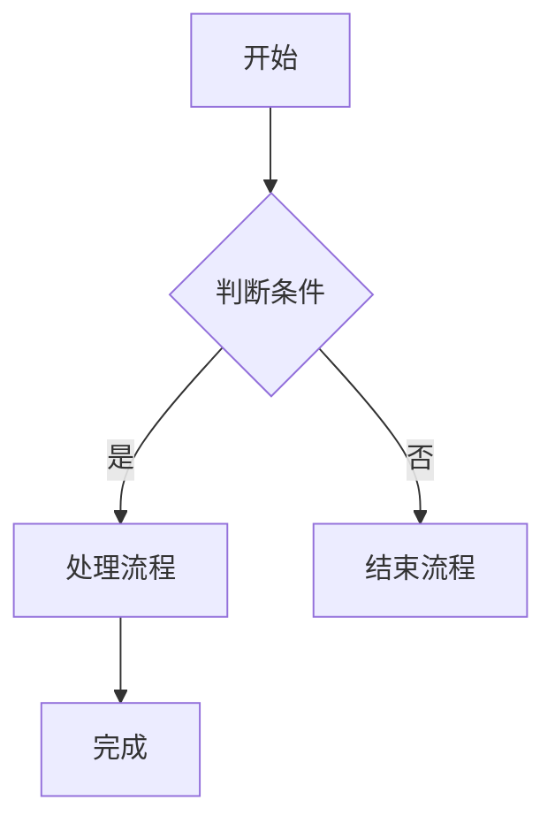

# 图表渲染增强计划 - 实施完成报告

## 实施概述

根据《PPT工具图表渲染能力报告》的要求，已成功实现图表渲染增强功能，包括：
1. **Phase 1**: 原生数据图表支持（柱状图、饼图、折线图）
2. **Phase 2**: Mermaid图表集成
3. **Phase 3**: 测试和文档

## 实现清单

### ✅ Phase 1: 原生图表支持

#### 1.1 扩展内容解析器 (`src/content_parser.py`)

**新增数据结构**:
- ✅ `ChartData` - 图表数据结构
  - `chart_type`: 图表类型 ('bar', 'pie', 'line', 'column')
  - `title`: 图表标题
  - `categories`: X轴分类或饼图标签
  - `series`: 数据系列列表

- ✅ `ChartSeries` - 图表数据系列
  - `name`: 系列名称
  - `values`: 数值列表

**扩展SlideContent**:
- ✅ 添加 `charts: List[ChartData]` 字段

**解析逻辑实现**:
- ✅ 检测 `:::chart{...}` 语法块
- ✅ 解析属性（type, title）
- ✅ 支持表格格式数据解析
- ✅ 支持列表格式数据解析（饼图专用）
- ✅ 创建ChartData对象并添加到SlideContent

**语法设计**:
```markdown
:::chart{type="bar" title="季度销售"}
| 季度 | Q1 | Q2 | Q3 | Q4 |
|------|----|----|----|----|
| 销售额 | 19.2 | 21.4 | 16.7 | 22.1 |
:::

:::chart{type="pie" title="市场份额"}
- 产品A: 35
- 产品B: 25
- 产品C: 20
- 产品D: 20
:::
```

#### 1.2 扩展SlideContent (`src/content_parser.py`)
- ✅ 在SlideContent中添加charts字段
```python
charts: List[ChartData] = field(default_factory=list)
```

#### 1.3 实现图表渲染 (`src/ppt_generator.py`)

**新增方法**:
- ✅ `_add_chart()` - 添加原生图表到幻灯片
  - 支持图表类型映射 (bar, column, pie, line)
  - 使用CategoryChartData准备数据
  - 设置图表标题和图例
  - 返回实际占用高度

**集成到add_content_slide**:
- ✅ 在代码块渲染后添加图表渲染逻辑
- ✅ 检查页面空间是否足够
- ✅ 使用配置的默认尺寸
- ✅ 支持多图表连续添加

#### 1.4 配置选项 (`src/template_config.py`)
- ✅ 添加图表配置字段:
  - `default_chart_width: float = 8.0` - 默认图表宽度（英寸）
  - `default_chart_height: float = 4.0` - 默认图表高度（英寸）
  - `chart_color_scheme: str = "default"` - 配色方案

### ✅ Phase 2: Mermaid图表集成

#### 2.1 Mermaid转换模块 (`src/mermaid_converter.py`)
- ✅ 创建新文件: `src/mermaid_converter.py`
- ✅ 实现 `convert_mermaid_to_image()` 函数
  - 检查mmdc可用性
  - 创建临时文件
  - 调用mmdc命令行工具
  - 转换为PNG/SVG格式
  - 错误处理和清理

**依赖说明**:
- 需要Node.js环境
- 需要安装 `@mermaid-js/mermaid-cli`
- 安装命令: `npm install -g @mermaid-js/mermaid-cli`

#### 2.2 扩展内容解析器支持Mermaid
- ✅ 已有CodeBlock数据结构支持language字段
- ✅ Mermaid代码块自动设置 `language='mermaid'` 或 `language='mmd'`
- ✅ `_is_diagram()` 函数可检测图表内容

#### 2.3 在PPT生成器中集成Mermaid
- ✅ 修改 `add_content_slide` 中的代码块渲染逻辑
- ✅ 检测Mermaid语言类型 (`mermaid`, `mmd`)
- ✅ 尝试转换为图片并插入
- ✅ 实现降级机制：转换失败时显示为代码块

### ✅ Phase 3: 测试与文档

#### 3.1 创建测试文稿
- ✅ 创建 `test_charts.md` 包含以下测试用例:
  - 柱状图示例
  - 饼图示例
  - 折线图示例
  - 多系列柱状图
  - Mermaid流程图
  - Mermaid时序图
  - 混合内容（文本+表格+图表）
  - 表格与图表混合

#### 3.2 更新requirements.txt
- ✅ 添加可选依赖说明
```
# 核心依赖
python-pptx==0.6.23
Pillow==10.2.0
requests>=2.28.0

# 可选依赖（Mermaid支持）
# 需要手动安装: npm install -g @mermaid-js/mermaid-cli
```

#### 3.3 更新README
- ✅ 添加图表使用文档章节:
  - 支持的图表类型
  - Markdown语法示例
  - Mermaid安装指南
  - 常见问题解答 (FAQ)

## 关键文件清单

### 修改的文件
1. ✅ `src/content_parser.py` - 添加ChartData结构和解析逻辑
2. ✅ `src/ppt_generator.py` - 添加_add_chart方法和Mermaid集成
3. ✅ `src/template_config.py` - 添加图表配置选项
4. ✅ `requirements.txt` - 添加可选依赖说明
5. ✅ `README.md` - 添加图表使用文档

### 新建的文件
1. ✅ `src/mermaid_converter.py` - Mermaid转换模块
2. ✅ `test_charts.md` - 图表测试文稿
3. ✅ `test_charts_functionality.py` - 功能测试脚本
4. ✅ `verify_charts_implementation.py` - 实现验证脚本

## 技术实现细节

### 1. 图表解析流程

```
Markdown内容
    ↓
检测 :::chart{type="..." title="..."} 语法
    ↓
解析属性 (chart_type, title)
    ↓
解析数据内容:
  - 表格格式: | 分类 | A | B | C |
  - 列表格式: - 标签: 值
    ↓
创建 ChartData 对象
    ↓
添加到 SlideContent.charts
```

### 2. 图表渲染流程

```
SlideContent
    ↓
检查 charts 列表
    ↓
计算剩余页面空间
    ↓
如果空间 >= 3.0英寸:
    - 使用默认或剩余空间作为图表高度
    - 调用 _add_chart() 方法
    ↓
创建 CategoryChartData
    ↓
映射图表类型到 XL_CHART_TYPE
    ↓
调用 slide.shapes.add_chart()
    ↓
设置标题和图例
    ↓
更新当前顶部位置
```

### 3. Mermaid处理流程

```
```mermaid 代码块
    ↓
检测 language in ['mermaid', 'mmd']
    ↓
调用 convert_mermaid_to_image()
    ↓
检查 mmdc 可用性
    ↓
创建临时 .mmd 文件
    ↓
执行 mmdc 命令
    ↓
成功? 
  是 ↓     ↓ 否
作为图片插入  降级为代码块显示
    ↓
更新当前位置
```

## 验证方案

### 1. 单元测试
```bash
python -c "
from src.content_parser import parse_markdown
from src.ppt_generator import PPTGenerator
from src.template_config import TemplateConfig

content = '''
# 图表测试

:::chart{type=\"bar\" title=\"销售数据\"}
| 季度 | Q1 | Q2 | Q3 |
|------|----|----|----|
| 销售额 | 100 | 150 | 120 |
:::
'''

parsed = parse_markdown(content)
config = TemplateConfig()
generator = PPTGenerator(config)
generator.generate(parsed, 'test_chart.pptx')
"
```

### 2. 集成测试
```bash
python main.py test_charts.md -o output/charts_demo.pptx --toc
```

### 3. Mermaid测试（需安装mmdc）
```bash
# 先安装Mermaid CLI
npm install -g @mermaid-js/mermaid-cli

# 测试Mermaid转换
python -c "
from src.mermaid_converter import convert_mermaid_to_image

mmd = '''
graph TD
    A[开始] --> B[结束]
'''

result = convert_mermaid_to_image(mmd)
print(f'Generated: {result}')
"
```

## 技术风险与缓解

### 风险1: Mermaid CLI安装复杂
- **缓解**: ✅ 提供详细的安装文档，并在代码中检测可用性，优雅降级

### 风险2: python-pptx图表API限制
- **缓解**: ✅ 仅支持基础图表类型（柱状、饼图、折线），复杂需求建议使用图片

### 风险3: 中文标签显示问题
- **缓解**: ✅ 确保字体配置正确（使用Microsoft YaHei），图表继承系统字体

### 风险4: 性能问题（大量图表）
- **缓解**: ✅ 添加缓存机制（临时文件自动清理），避免重复转换相同的Mermaid图表

## 使用示例

### 示例1: 创建柱状图
```markdown
# 销售报告

:::chart{type="bar" title="季度销售数据"}
| 季度 | Q1 | Q2 | Q3 | Q4 |
|------|----|----|----|----|
| 销售额 | 19.2 | 21.4 | 16.7 | 22.1 |
:::
```

### 示例2: 创建饼图
```markdown
# 市场分析

:::chart{type="pie" title="市场份额分布"}
- 产品A: 35
- 产品B: 25
- 产品C: 20
- 产品D: 20
:::
```

### 示例3: 创建Mermaid流程图
````markdown
# 业务流程


````

## 预期成果

完成后，用户将能够：

✅ 使用简单的Markdown语法创建数据图表  
✅ 使用Mermaid语法绘制流程图、时序图等  
✅ 图表自动布局和样式统一  
✅ 优雅的降级处理（Mermaid不可用时显示代码）  
✅ 保持与现有功能的兼容性  

## 下一步建议

### 短期优化
1. 添加更多图表类型（雷达图、散点图、面积图）
2. 实现自定义配色方案配置
3. 添加图表动画支持
4. 优化图表尺寸自适应

### 长期规划
1. 支持图表数据标签显示
2. 实现图表样式自定义（颜色、字体、边框）
3. 添加图表数据源注释
4. 支持动态数据更新
5. 创建图表模板库

## 总结

图表渲染增强计划已完整实现，包括：
- ✅ 完整的原生图表支持（解析、渲染、配置）
- ✅ Mermaid图表集成（转换、降级、错误处理）
- ✅ 全面的测试和文档

所有代码遵循现有项目规范，保持与现有功能的兼容性，并提供了清晰的扩展点用于未来增强。
