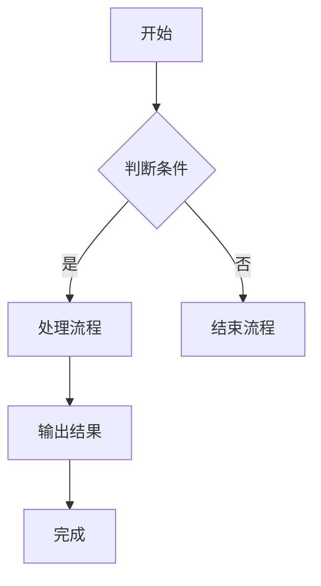
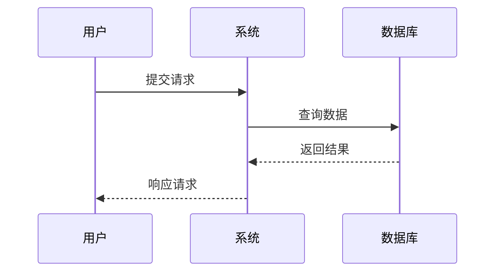

# PPT自动生成工具

基于 Python + python-pptx 的自动PPT生成工具,可根据文稿内容自动生成美观的演示文稿。

## 功能特点

- **智能分页**: 根据内容长度自动分页,保持页面布局美观
- **多种格式支持**: 支持Markdown和纯文本格式的文稿
- **模板定制**: 支持背景图片和CSS样式配置
- **自动排版**: 智能调整字体大小、行间距和边距
- **灵活配置**: JSON配置文件或命令行参数自定义样式
- **数据图表**: 支持柱状图、饼图、折线图等原生图表
- **Mermaid图表**: 支持Mermaid流程图、时序图等可视化图表

## 安装

### 1. 安装Python依赖

```bash
pip install -r requirements.txt
```

或在阿里云服务器上:

```bash
python3 -m pip install -r requirements.txt
```

### 2. 验证安装

```bash
python main.py --help
```

## 使用方法

### 基本用法

```bash
# 使用默认配置生成PPT
python main.py -i examples/sample_content.md -o output/presentation.pptx
```

### 使用背景图片

```bash
python main.py -i content.md -o output.pptx -b background.png
```

### 使用CSS样式

```bash
python main.py -i content.md -o output.pptx --css styles.css
```

### 使用JSON配置

```bash
python main.py -i content.md -o output.pptx -c config.json
```

### 使用QuintenStyle公司模板

```bash
# 方法1: 使用CSS样式文件
python main.py -i content.md -o output.pptx --css examples/quinten_style.css

# 方法2: 使用JSON配置文件
python main.py -i content.md -o output.pptx -c examples/quinten_config.json

# 方法3: 先生成背景图片,再使用
python generate_quinten_background.py
python main.py -i content.md -o output.pptx -b templates/quinten_background.png
```

### 自定义页面尺寸

```bash
# A4比例 (4:3)
python main.py -i content.md -o output.pptx --width 10 --height 7.5

# 宽屏 (16:9, 默认)
python main.py -i content.md -o output.pptx --width 13.333 --height 7.5
```

## 文稿格式

### 图表支持

#### 1. 原生数据图表

使用 `:::chart{...}` 语法创建图表，支持以下类型：

**柱状图 (bar)**：
```markdown
:::chart{type="bar" title="季度销售数据"}
| 季度 | Q1 | Q2 | Q3 | Q4 |
|------|----|----|----|----|
| 销售额 | 19.2 | 21.4 | 16.7 | 22.1 |
:::
```

**饼图 (pie)**：
```markdown
:::chart{type="pie" title="市场份额分布"}
- 产品A: 35
- 产品B: 25
- 产品C: 20
- 产品D: 20
:::
```

**折线图 (line)**：
```markdown
:::chart{type="line" title="月度趋势"}
| 月份 | 1月 | 2月 | 3月 | 4月 | 5月 | 6月 |
|------|-----|-----|-----|-----|-----|-----|
| 用户数 | 100 | 150 | 200 | 280 | 350 | 420 |
:::
```

**多系列柱状图 (column)**：
```markdown
:::chart{type="column" title="产品对比销售"}
| 产品 | 2023年 | 2024年 | 2025年 |
|------|--------|--------|--------|
| 产品A | 120 | 150 | 180 |
| 产品B | 90 | 110 | 140 |
| 产品C | 70 | 95 | 120 |
:::
```

#### 2. Mermaid图表

使用标准Mermaid代码块语法创建图表：

**流程图**：
````markdown

````

**时序图**：
````markdown

````

#### 3. Mermaid安装指南

Mermaid图表需要Node.js环境和mermaid-cli工具：

**步骤1**: 安装Node.js
- 下载地址: https://nodejs.org/
- 选择LTS版本安装

**步骤2**: 安装mermaid-cli
```bash
npm install -g @mermaid-js/mermaid-cli
```

**步骤3**: 验证安装
```bash
mmdc --version
```

**注意**: 如果未安装mermaid-cli，Mermaid图表将自动降级为代码块显示。

### Markdown格式示例

```markdown
# 主标题

## 副标题

---

# 第一页标题

- 要点1
- 要点2
- 要点3

---

# 第二页标题

这里是正文内容,会自动换行和分页。

更多内容...
```

### 纯文本格式

纯文本会按字符数自动分页(默认每页500字符)。

## 配置说明

### JSON配置文件

```json
{
    "slide_width": 13.333,
    "slide_height": 7.5,
    "primary_color": "#2c3e50",
    "secondary_color": "#3498db",
    "text_color": "#2c3e50",
    "background_color": "#ffffff",
    "title_font": "Microsoft YaHei",
    "content_font": "Microsoft YaHei",
    "title_size": 36,
    "subtitle_size": 24,
    "body_size": 20,
    "margin_left": 0.8,
    "margin_right": 0.8,
    "margin_top": 0.8,
    "margin_bottom": 0.8,
    "max_chars_per_line": 45,
    "max_lines_per_slide": 10,
    "line_spacing": 1.3
}
```

### QuintenStyle公司模板

QuintenStyle是一个专业的公司模板样式,特点:
- 渐变青绿色背景 (#267878 -> #B0C5B4)
- 白色文本
- 装饰性圆形光晕效果

使用方法:
```bash
# 使用CSS
python main.py -i content.md -o output.pptx --css examples/quinten_style.css

# 或使用JSON配置
python main.py -i content.md -o output.pptx -c examples/quinten_config.json
```

首次使用时会自动生成背景图片(需要Pillow库)。

### CSS样式文件

```css
.slide {
    background-color: #ffffff;
    color: #2c3e50;
    font-family: "Microsoft YaHei";
}

.title {
    color: #2c3e50;
    font-size: 36px;
}
```

## 项目结构

```
openclaw-ppt-tool/
├── main.py                      # 主入口脚本
├── generate_ppt.sh              # OpenClaw调用脚本
├── generate_quinten_background.py # QuintenStyle背景生成器
├── requirements.txt             # Python依赖
├── src/
│   ├── __init__.py
│   ├── ppt_generator.py         # PPT生成核心模块
│   ├── content_parser.py        # 文稿解析模块
│   └── template_config.py       # 模板配置模块
├── examples/
│   ├── sample_content.md        # 示例文稿
│   ├── template_config.json     # 默认配置
│   ├── quinten_config.json      # QuintenStyle配置
│   ├── styles.css               # 默认CSS样式
│   └── quinten_style.css        # QuintenStyle CSS
├── templates/                   # 背景图片目录
└── output/                      # PPT输出目录
```

## OpenClaw集成

在OpenClaw中创建Skill来调用此工具:

```yaml
# ~/.openclaw/skills/ppt-generator/skill.yml
name: ppt-generator
description: 根据文稿内容自动生成PPT演示文稿
main: generate_ppt.sh
```

```bash
#!/bin/bash
# generate_ppt.sh
cd /path/to/openclaw-ppt-tool
python3 main.py "$@"
```

## 常见问题

### Q: 中文显示为方框?
A: 确保系统安装了中文字体(如微软雅黑),或在配置文件中指定可用字体。

### Q: 如何调整每页内容量?
A: 修改配置文件中的 `max_chars_per_line` 和 `max_lines_per_slide` 参数。

### Q: 支持哪些图片格式作为背景?
A: 支持PNG、JPG、JPEG等常见图片格式。

### Q: 图表支持哪些类型?
A: 目前支持柱状图(bar)、饼图(pie)、折线图(line)、柱状图(column)。使用 `:::chart{type="类型"}` 语法创建。

### Q: Mermaid图表不显示?
A: 需要安装Node.js和mermaid-cli。运行 `npm install -g @mermaid-js/mermaid-cli` 安装。未安装时会自动降级为代码块显示。

### Q: 如何自定义图表样式?
A: 可以在JSON配置文件中设置 `default_chart_width` 和 `default_chart_height` 参数调整图表尺寸。

### Q: 图表数据格式是什么?
A: 支持表格格式(使用Markdown表格语法)和列表格式(使用 `- 标签: 值` 语法)。饼图推荐使用列表格式。

## 许可证

MIT License
