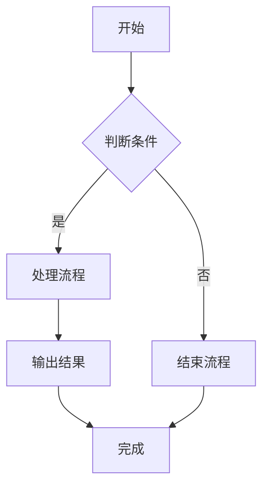
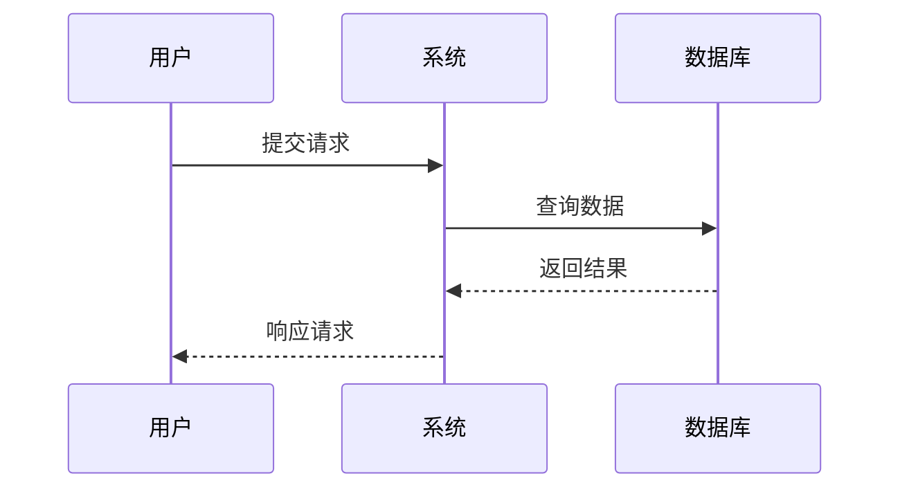

# 图表渲染测试

## 柱状图示例

:::chart{type="bar" title="季度销售数据"}
| 季度 | Q1 | Q2 | Q3 | Q4 |
|------|----|----|----|----|
| 销售额 | 19.2 | 21.4 | 16.7 | 22.1 |
:::

## 饼图示例

:::chart{type="pie" title="市场份额分布"}
- 产品A: 35
- 产品B: 25
- 产品C: 20
- 产品D: 20
:::

## 折线图示例

:::chart{type="line" title="月度趋势"}
| 月份 | 1月 | 2月 | 3月 | 4月 | 5月 | 6月 |
|------|-----|-----|-----|-----|-----|-----|
| 用户数 | 100 | 150 | 200 | 280 | 350 | 420 |
:::

## 多系列柱状图

:::chart{type="column" title="产品对比销售"}
| 产品 | 2023年 | 2024年 | 2025年 |
|------|--------|--------|--------|
| 产品A | 120 | 150 | 180 |
| 产品B | 90 | 110 | 140 |
| 产品C | 70 | 95 | 120 |
:::

## Mermaid流程图

## Mermaid时序图

## 混合内容 - 文本和图表

### 销售分析

本季度销售表现良好，总体呈现增长趋势。

**关键数据**：
- Q1销售额：19.2万
- Q2销售额：21.4万
- Q3销售额：16.7万
- Q4销售额：22.1万

:::chart{type="bar" title="销售数据分析"}
| 季度 | Q1 | Q2 | Q3 | Q4 |
|------|----|----|----|----|
| 销售额 | 19.2 | 21.4 | 16.7 | 22.1 |
| 增长率 | 12% | -22% | 32% | 15% |
:::

## 表格与图表混合

| 产品 | 价格 | 销量 | 收入 |
|------|------|------|------|
| 产品A | 100 | 50 | 5000 |
| 产品B | 150 | 30 | 4500 |
| 产品C | 200 | 20 | 4000 |

:::chart{type="pie" title="收入占比"}
- 产品A: 5000
- 产品B: 4500
- 产品C: 4000
:::
