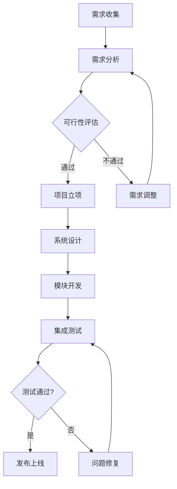
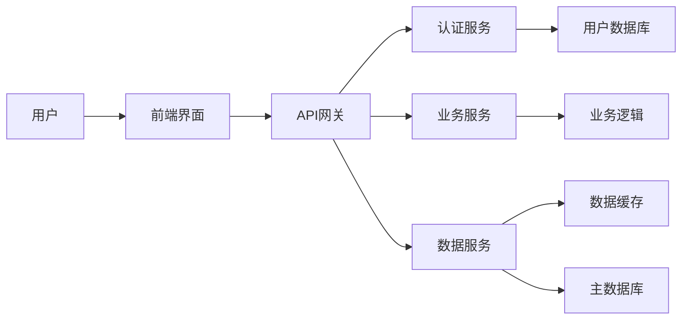
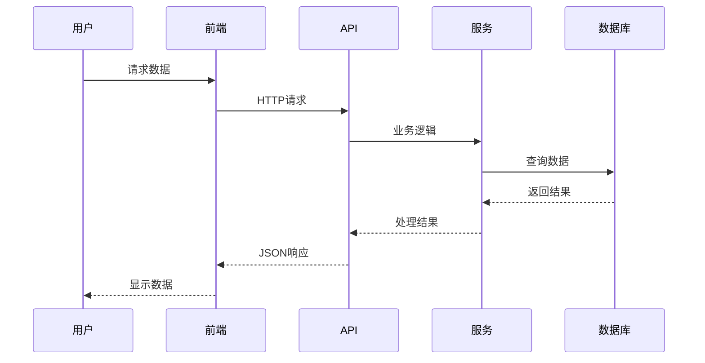

# 智能布局测试 - 复杂内容混合

## 第一个幻灯片 - 多个图表

### 销售数据

:::chart{type="bar" title="季度销售趋势"}
| 季度 | Q1 | Q2 | Q3 | Q4 |
|------|----|----|----|----|
| 销售额 | 19.2 | 21.4 | 16.7 | 22.1 |
| 利润 | 5.2 | 6.1 | 4.8 | 7.3 |
:::

### 市场份额

:::chart{type="pie" title="产品市场份额"}
- 产品A: 35
- 产品B: 25
- 产品C: 20
- 产品D: 15
- 其他: 5
:::

## 第二个幻灯片 - 文本和Mermaid

### 业务流程说明

这是一个复杂的业务流程，包含多个阶段和决策点。

**第一阶段**：需求分析和规划
- 收集用户需求
- 分析可行性
- 制定项目计划

**第二阶段**：设计和开发
- 系统架构设计
- 模块开发
- 集成测试

## 第三个幻灯片 - 表格和文本混合

### 产品对比数据

| 产品 | 价格 | 功能评分 | 用户满意度 | 市场份额 |
|------|------|----------|------------|----------|
| 产品A | ¥199 | 8.5/10 | 92% | 35% |
| 产品B | ¥159 | 7.8/10 | 88% | 25% |
| 产品C | ¥129 | 7.2/10 | 85% | 20% |
| 产品D | ¥99 | 6.5/10 | 80% | 15% |

### 详细说明

产品A在功能和用户满意度方面都表现最好，但价格也最高。
产品D虽然功能相对简单，但价格优势明显，适合预算有限的用户。

**选择建议**：
- 如果预算充足且需要完整功能，选择 **产品A**
- 如果追求性价比，选择 **产品B**
- 如果预算有限，选择 **产品D**

## 第四个幻灯片 - 多个Mermaid图表

### 系统架构

### 数据流

## 第五个幻灯片 - 大段文本和图表

### 年度总结报告

**2024年业绩回顾**

今年我们取得了显著的增长，主要体现在以下几个方面：

1. **收入增长**：全年收入同比增长35%，超出预期目标
2. **客户扩展**：新增企业客户120家，活跃用户增长80%
3. **产品创新**：发布3个重大版本更新，新增15项核心功能
4. **团队建设**：团队规模从30人扩展到50人，引进多位资深工程师

**面临的挑战**

- 市场竞争加剧，需要持续提升产品差异化
- 技术债务积累，需要投入更多时间进行重构
- 人才招聘难度大，需要优化招聘策略

**2025年展望**

:::chart{type="line" title="收入预测"}
| 季度 | Q1预测 | Q2预测 | Q3预测 | Q4预测 |
|------|--------|--------|--------|--------|
| 收入 | 25.0 | 28.5 | 32.0 | 35.5 |
| 成本 | 18.0 | 19.5 | 21.0 | 22.5 |
:::

**关键目标**：
- 收入目标：同比增长50%
- 客户目标：新增200家企业客户
- 产品目标：发布5个重大版本
- 团队目标：扩展到80人
